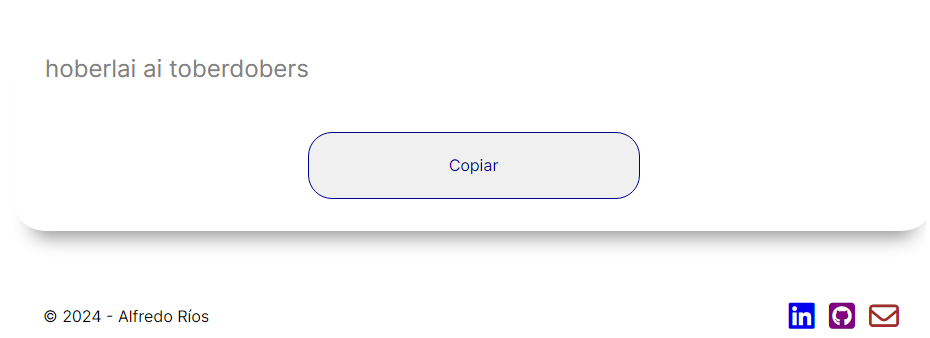
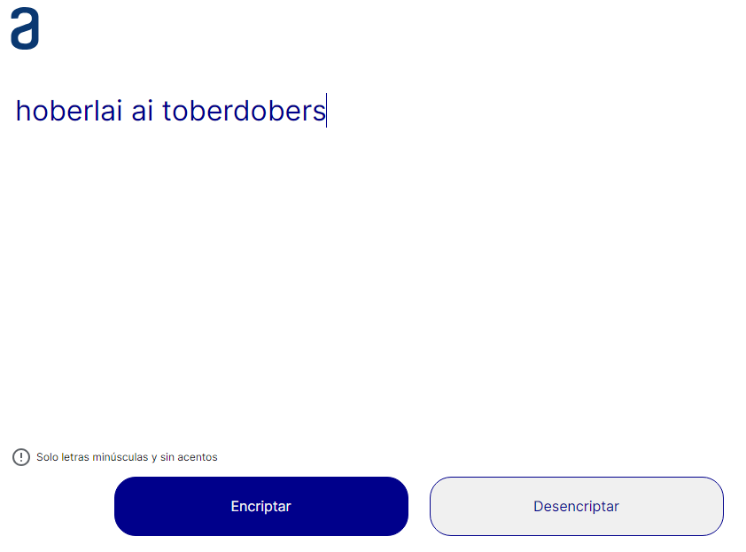
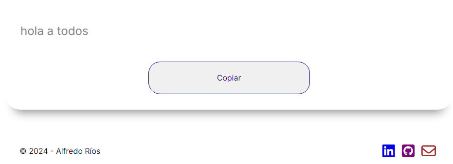

# Alura Challenge: Encriptador de texto
Encriptador y desencriptador de textos simples.

Primer Challenge de Alura Latam + ONE

 

## Modo de uso
Las "llaves" de encriptación son:
```
La letra "e" es convertida para "enter"
La letra "i" es convertida para "imes"
La letra "a" es convertida para "ai"
La letra "o" es convertida para "ober"
La letra "u" es convertida para "ufat"
```
Podemos encriptar y desencirptaar textos escritos **solamente** en minúscula y sin acentos.

Una vez escrito el texto, haga click en el botón ```Encriptar``` y se mostrará el texto encriptado.

En el cuadro de resultado se muestra el botón ```Copiar``` para copiar el resultado al portapapeles de tu dispositivo.

Para desencriptar, debemos ingresar un texto encriptado y presionar el botón ```Desencriptar```.

Ejemplo de entrada y salida:
```
"hola a todos" => "hoberlai ai toberdobers"
"hoberlai ai toberdobers" => "hola a todos"
```

## Imágenes del programa
### Ejemplo de texto a encriptar

### Resultado de texto encriptado

### Ejemplo de texto a desencriptar

### Resultado de texto desencriptado

</br>
</br>
</br>

### Versión Mobile

### Versión Tablet

### Versión Desktop

